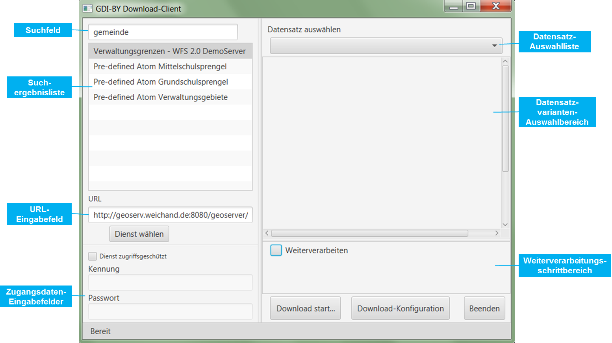
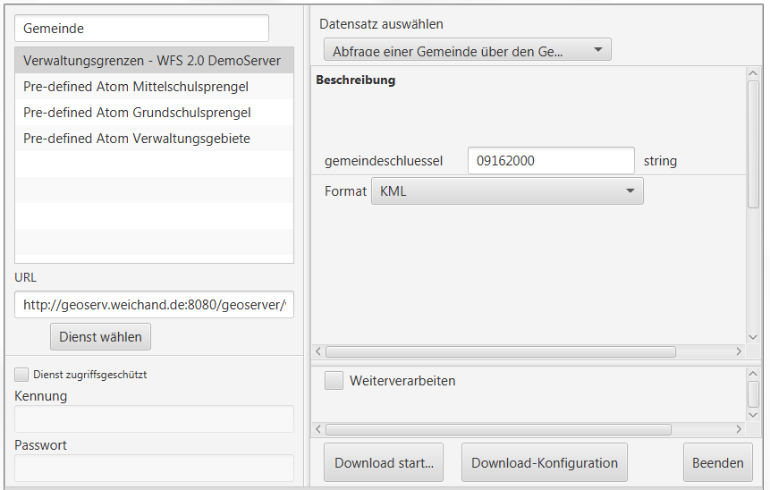
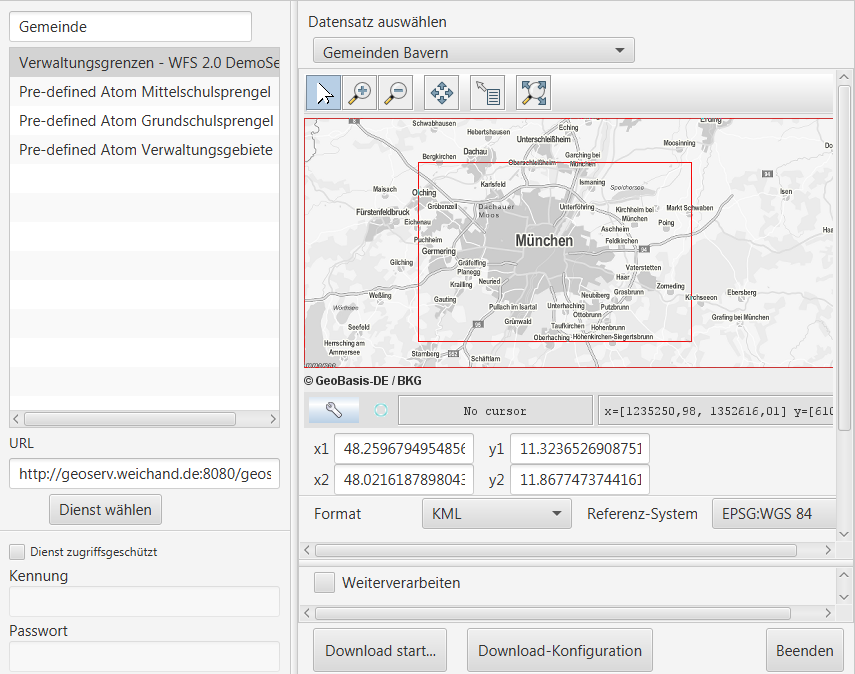
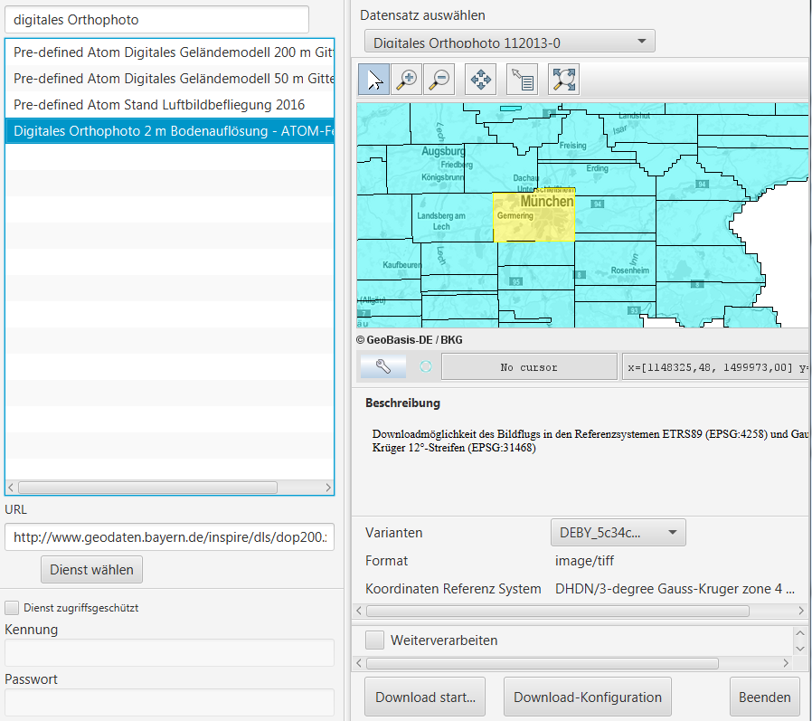
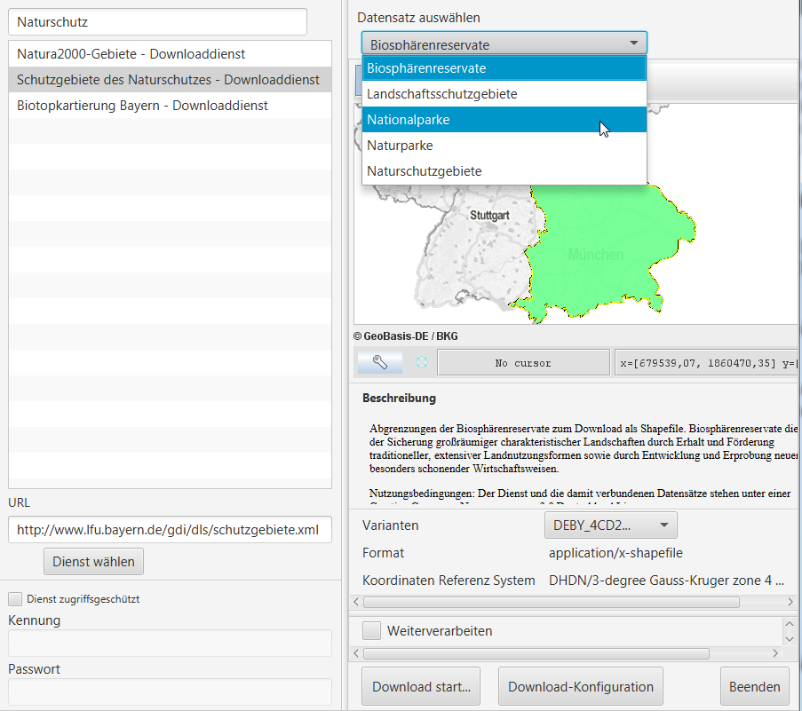

=======================================================
GDI-BY Download-Client Dokumentation
=======================================================
:Autor: Geschäftsstelle Geodateninfrastruktur Bayern (GDI-BY)
:Kontakt: gdi-by@ldbv.bayern.de

Einleitung
============

Der Download-Client ist eine Desktop-Anwendung zum einfachen Herunterladen von Geodaten, die über Downloaddienste verfügbar sind. Für die heruntergeladenen Geodaten können optional Weiterverarbeitungsschritte (z. B. Formatkonvertierung) definiert und ausgeführt werden. Die Konfiguration der Download- und Weiterverarbeitungsschritte kann darüber hinaus abgespeichert und über ein Konsolenprogramm erneut ausgeführt werden.

Der Download-Client wird von der Geodateninfrastruktur Bayern (GDI-BY) als Open-Source-Software unter der Apache License 2.0 zur Verfügung gestellt.

Installation
============

Der Download-Client steht in Form von Zip-Archiven für Windows und Linux hier bereit: http://www.gdi.bayern/downloadclient

Voraussetzungen - Softwareumgebung
------------------------------------

**Für die Ausführung des Download-Clients wird mindestens Java 1.8.0.40 benötigt.**

Aktuelle Java-Versionen können hier heruntergeladen werden: http://www.oracle.com/technetwork/java/javase/downloads/index.html

Inbetriebnahme
--------------

Das Zip-Archiv an einen geeigneten Ort entpacken.

Starten der Anwendung
----------------------

Die Datei "startup.bat" ausführen.

Proxy-Einstellungen
--------------------

Falls notwendig, können im Unterordner config des entpackten Download-Client-Programmordners Proxy-Einstellungen in einer Datei mit Namen ``proxy.xml`` abgelegt werden. Der config-Ordner beinhaltet hierfür eine beispielhafte Datei ``proxy.xml.sample``, die folgende Felder zur Konfiguration von HTTP(S) Proxy-Einstellungen enthält:

 <!-- HTTP settings: --> HOST PORT USER PASSWORD HOST1|HOST2|... <!-- HTTPS settings: --> HOST PORT USER PASSWORD HOST1|HOST2|... 

Alle Felder sind dabei optional. Um die Anwendung der Einstellungen zu vermeiden, kann ``overrideSystemSetting="false"`` gesetzt werden. Über enableSNIExtension kann die Server Name Indication aktiviert/deaktiviert werden, was bei „problematischen“ SSL-Hosts notwendig sein könnte. 

Funktionalität
==============

Unterstützte Downloaddienstvarianten
---------------------------------------

Aktuell werden folgende INSPIRE-Downloaddienstvarianten[1_] vom Download-Client unterstützt:

+-------------------------------------+--------------------------------+----------------------------+
| Variante                            | Standard                       | Konformitätsklasse         |
+=====================================+================================+============================+
| Pre-defined Dataset Downlaod        | Web Featrue Service (WFS)  2.0 |  Simple WFS                |
+-------------------------------------+--------------------------------+----------------------------+
| Direct Access Download              | WFS 2.0                        |  Basic WFS                 |
+-------------------------------------+--------------------------------+----------------------------+
| Pre-defined Dataset Download        | predefined ATOM                |                            |
+-------------------------------------+--------------------------------+----------------------------+

.. [1] gemäß der Technical Guidance for the Implementation of INSPIRE Download Services, Version 3.1, s. http://inspire.jrc.ec.europa.eu/documents/Network_Services/Technical_Guidance_Download_Services_v3.1.pdf

Benutzeroberfläche 
-------------------

Auswahl von Downloaddiensten
------------------------------
Downloaddienste können über verschiedene Wege eingebunden werden: 

- Eingabe der URL eines Downloaddienstes (vollständige GetCapabilities-URL inkl. Paramater bei WFS oder URL des ATOM Downloaddienstes) 

- Suche nach Downloaddiensten durch Eingabe eines Suchbegriffes in das Suchfeld. Hier wird im Hintergrund ein GetRecord-Aufruf an einen Metadatenkatalogdienst (CSW) mit einem Filter *ServiceTypeVersion = OGC:WFS:2.0* oder *ATOM* durchgeführt. Standardmäßig ist hier der Metadatenkatalog der GDI-BY (http://geoportal.bayern.de/csw/gdi?) eingebunden. Das Einbinden anderer Kataloge ist möglich (s. Abschnitt „Benutzerdefinierte Erweiterungsmöglichkeiten“)

Beispiel-URLs sind:

- http://geoserv.weichand.de:8080/geoserver/wfs?service=WFS&acceptversions=2.0.0&request=getCapabilities (WFS 2.0.0)
- https://geoportal.bayern.de/gdiadmin/ausgabe/ATOM_SERVICE/4331d3ef-a12d-48be-a9b9-9597c2591448 (Atom)
- http://www.geodaten.bayern.de/inspire/dls/dop200.xml (Atom)

Über den Button *Dienst wählen* kann ein Downloaddienst eingebunden werden. Bei zugriffsgeschützten Diensten müssen die Zugangsdaten entsprechend in den Feldern *Kennung* und *Passwort* eingetragen werden. 

Ist nicht bekannt, ob ein Dienst passwortgeschützt ist oder nicht, so kann einfach die URL in das entsprechende Feld eingetragen werden. Nach einer Überprüfung wird vom Client gegebenenfalls die Meldung *"Service ist zugangsbeschränkt. Geben Sie Nutzername und Passwort an."* angezeigt.

Die grafische Benutzeroberfläche passt sich je nach der gewählten Downloaddienstvariante automatisch an: 

Download von Datensätzen eines WFS 2.0 
---------------------------------------

Beim Download von Datensätzen eines WFS 2.0 werden in der Datensatz-Auswahlliste sowohl alle FeatureTypes des WFS als auch alle vordefinierten Abfragen ("Stored Queries" - wenn vorhanden) zum Download angeboten. 
Standardmäßig ist der erste Eintrag der Liste ausgewählt.
 
*********************
Vordefinierte Abfrage
*********************

Bei Auswahl einer vordefinierten Abfrage passt sich der Datensatzvarianten-Auswahlbereich dahingehend an, dass die Abfrageparameter als Eingabefelder sowie (falls vorhanden) eine Beschreibung der vordefinierten Abfrage erscheinen. Zusätzlich kann eines der vom Dienst nativ angebotenen Ausgabedatenformate gewählt werden.

**Beispiel:**

Im oben dargestellten Beispiel wird als Suchbegriff *"Gemeinde"* im entsprechenden Suchfenster eingegeben und der Downloaddienst *"Verwaltungsgrenzen - WFS 2.0 DemoServer"* verwendet. Die vordefinierte Abfrage lautet *"Abfrage einer Gemeinde über den Gemeindeschlüssel"*. 
Dabei wird die Grenze der Stadt München mit dem Schlüssel *09162000* im Format *KML* abgefragt. Mit Klick auf den Button „Download start...“ unter Angabe eines Zielordners wird der Download angestoßen.

************
FeatureTypes
************

Handelt es sich um ein FeatureType, so kann der Nutzer über die Kartenkomponente ein Begrenzungsrechteck aufziehen und so den Bereich wählen, für welchen er Daten beziehen möchte. 
Zusätzlich kann noch ein Ausgabedatenformat und ein Koordinatenreferenzsystem gewählt werden, welche vom WFS nativ unterstützt werden. 

**Beispiel:**

Im oben dargestellten Beispiel wird als Suchbegriff *"Gemeinde"* im entsprechenden Suchfenster eingegeben und der Downloaddienst *"Verwaltungsgrenzen - WFS 2.0 DemoServer"* verwendet. Anschließend wird der FeatureType *"GemeindenBayern"* ausgewählt und auf der Karte ein Rechteck aufgezogen. Somit können sämtliche Gemeindegrenzen heruntergeladen werden, welche sich mit dem Begrenzungsrechteck berühren. Als Ausgabedatenformat wird *KML* gewählt, das Koordinatenreferenzsystem soll *WGS84* sein.

Download von Datensätzen eines predefined ATOM Downloaddienstes
------------------------------------------------------------------

Beim Download von Datensätzen eines predefined ATOM Downloaddienstes werden in der Datensatz-Auswahlliste alle verfügbaren ServiceFeed-Einträge (=Datensätze) zum Download angeboten. Standardmäßig ist der erste Eintrag der Liste ausgewählt. 

Der Nutzer hat die Möglichkeit, die Auswahl durch Wahl eines anderen Eintrags der Liste oder durch Wahl eines Bereiches in der Kartenkomponente zu ändern. 

Einschränkung: Die Auswahl eines Datensatzes über die Kartenkomponente ist nur dann möglich, wenn die geographischen Begrenzungspolygone der einzelnen Datensätze sich nicht überlagern. 

**Beispiel Variante a):**

Im oben dargestellten Beispiel wird als Suchbegriff *"digitales Orthophoto"* im entsprechenden Suchfenster eingegeben und der Downloaddienst *"Digitales Orthophoto 2 m Bodenauflösung - ATOM-Feed"* verwendet.
Der Dienst stellt Datensätze mit unterschiedlichen geographischen Begrenzungspolygonen zum Download zur Auswahl. Somit ist eine Auswahl über die Kartenkomponente möglich. Es wird der Datensatz *"Digitales Orthophoto 112013-0"* in der Variante *"Gauß-Krueger Zone 4"* (EPSG:31468) gewählt. 

**Beispiel Variante b):**

Im oben dargestellten Beispiel wird als Suchbegriff *"Naturschutz"* im entsprechenden Suchfenster eingegeben und der Downloaddienst *"Schutzgebiete des Naturschutzes - Downloaddienst"* verwendet.
Der Dienst bietet die Datensätze Naturparke, Nationalparke, Naturschutzgebiete, Biosphärenreservate und Landschaftsschutzgebiete zum Download zur Auswahl. 
Da die Datensätze jeweils eine bayernweite Ausdehnung haben, ist nur eine Auswahl über die Dropdown-Liste möglich.
Es wird der Datensatz *"Nationalparke"* in der Variante *"Gauß-Krueger Zone 4"* gewählt. 

Weiterverarbeitung der heruntergeladenen Datensätze
------------------------------------------------------

Die heruntergeladenen Datensätze  können mit Hilfe des Download-Clients zu einem individuellen Endergebnis weiterverarbeitet werden (=Verarbeitungskette). 

Nach Anhaken von "Weiterverarbeiten" können über den Button "Hinzufügen" ein oder mehrere Verarbeitungsschritte hinzugefügt werden.

Folgende Verarbeitungsschritte stehen bereits vorkonfiguriert zur Verfügung: 

- Konvertierung eines Vektordatenformates nach ESRI-Shape nach Eingabe des folgenden Parameters: 
   - Koordinatenreferenzsystem 

- Konvertierung eines Rasterdatenformates nach GeoTIFF nach Eingabe des folgenden Parameters:
   - Koordinatenreferenzsystem

Die zur Verfügung stehenden Verarbeitungsschritte können durch Anpassung der Verarbeitungskonfigurations-Datei (s.u. „Benutzerdefinierte Erweiterungsmöglichkeiten) bei Bedarf durch den Anwender beliebig ergänzt und konfiguriert werden. 

.. image:: img/DLC_Weiterverarbeitung_DOP.png

Im oben dargestellten Beispiel wird vom Downloaddienst "Digitales Orthophoto 2 m Bodenauflösung - ATOM-Feed" der Datensatz "Digitales Orthophoto 112013-0" in der Variante "Gauß-Krueger Zone 4" abgerufen. Als Verarbeitungsschritt wird „Konvertierung nach GeoTIFF“ gewählt. Falls der Datensatz aus mehreren physischen Dateien besteht, werden diese bei der Konvertierung zu einer Datei zusammengefügt.

Download-Logfiles
-------------------

Für jeden Download, der über den Button „Download start…“ angestoßen wurde, wird im Ordner, der als Speicherort für den Download angegeben wurde, automatisch ein Logfile (Dateiname download_<DatumUhrzeitNr>.log) gespeichert. 

Ausführungswiederholung
---------------------------

Eine Download-Konfiguration kann über den entsprechenden Button als XML-Datei (Dateiname config<DatumUhrzeitNr>.xml) gespeichert und über ein Konsolenprogramm erneut bzw. in regelmäßigen Intervallen ausgeführt werden. 
 
**Windows:**

Variante a) Ausführungswiederholung mit Windows Eingabeaufforderung (CMD)

- Angaben: Batch-Skript startup-headless.bat und o.g. XML-Konfigurationsdatei inkl. Pfad
- Bsp.: ``startup-headless.bat C:\TEMP\config20160909142610.xml``

Variante b) Ausführungswiederholung mit Windows Aufgabenplanung (Voraussetzung: Ausführung als Administrator)

- Programm/Skript: ausführbare Eingabeaufforderungsdatei inkl. Pfad (Bsp.: ``C:\Windows\SysWOW64\cmd.exe``)
- Argumente: Batch-Skript startup-headless.bat und o.g. XML-Konfigurationsdatei inkl. Pfad (Bsp.:  ``/c"startup-headless.bat C:\TEMP\config20160909142610.xml"``)
- Starten in: Pfad, unter der Batch-Datei startup-headless.bat liegt

**Linux:** 

Die Ausführungswiederholung ist über Cronjobs möglich.

Benutzerdefinierte Erweiterungsmöglichkeiten 
=============================================

Die Funktionalität des Download-Client ist durch den Nutzer erweiterbar bzw. individuell anpassbar. Hierzu können die Default-Einstellungen an folgenden Konfigurationsdateien, die sich im Unterordner config des Download-Client-Programmordners befinden, angepasst werden: 

settings.xml
------------

Hier können folgende Einstellungen angepasst werden:

- im Element ``<catalogues>``: eingebundene(r) Metadatenkatalog(e) für die Dienstesuche

- im Element ``<wms>``: eingebundener Darstellungsdienst für die Kartenkomponente im Datensatzvarianten-Auswahlbereich der Benutzeroberfläche

- im Element ``<services>`` können Downloaddienste folgendermaßen fest in die Dienstesuche eingebunden werden:

.. code-block:: xml

   <services>
     <service>
       <name>Ein WFS Name</name>
       <url>EineWFSURL?</url>
     </service>
     <service>
       <name>Ein ATOM-Feed Name</name>
       <url>EineAtomFeedURL</url>
     </service>
   </services>

- im Element ``<check-restriction>`` können Downloaddienste angegeben
  werden, welche die Prüfung der Verfügbarkeit, sowie des potentiellen
  Passwortschutzes über HTTP-HEAD ablehnen und daher alternativ über HTTP-GET
  überprüft werden müssen:

.. code-block:: xml

   <check-restriction>
     <use-get-url>http://example1.com/.*$</use-get-url>
     <use-get-url>(http|https)://example2.com/.*$</use-get-url>
   </check-restriction>

verarbeitungsschritte.xml
---------------------------

Hier können bestehende Verarbeitungsschritte modifiziert oder neue Verarbeitungsschritte angelegt werden, indem u.a. folgende Einstellungen vorgenommen werden:

-	im Element ``<Befehl>``: Angabe eines Befehls aus der GDAL (Bibliothek zur Geodatenverarbeitung) oder einer ausführbaren Datei mit einem Python Skript

- im Element ``<ParameterSet>``: für die Ausführung des Befehls notwendige Ein- und Ausgabeparameter

- im Element ``<Eingabeelement>``: Definition von Eingabeelementen für die Benutzeroberfläche wie bspw. Text-Eingabefelder (`typ="TextField"`) oder Auswahllistenfeldern (`typ="ComboBox"`)

mimetypes.xml
--------------

Hier kann die Liste der angegebenen MIMETypes erweitert werden. Jedem MIMEType wird eine Dateierweiterungen sowie ein Formattyp ("raster"/"vektor") zugeordnet.

