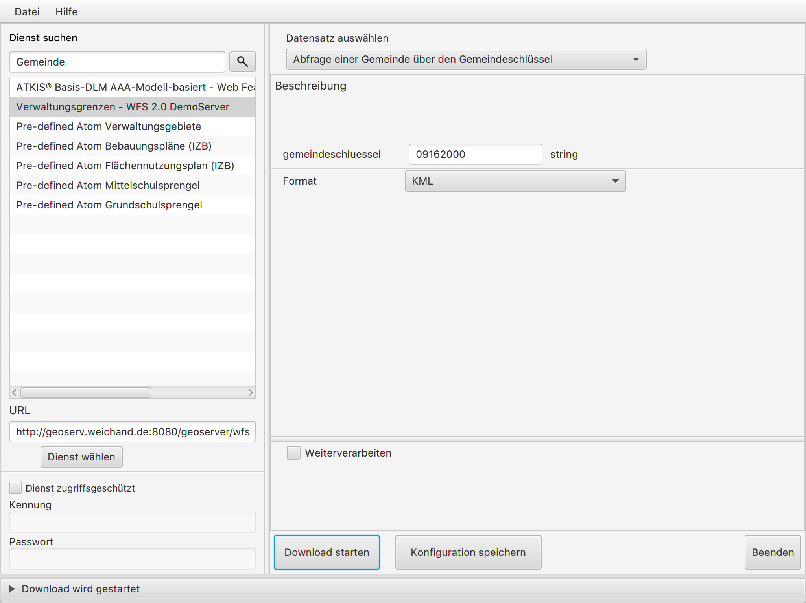
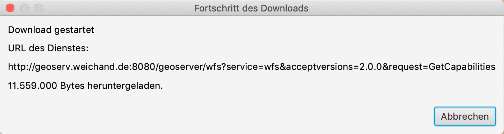
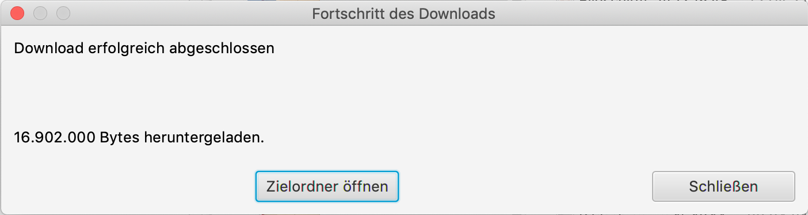

=======================================================
GDI-BY Download-Client Dokumentation - Version 1.2.6
=======================================================
:Autor: Geschäftsstelle Geodateninfrastruktur Bayern (GDI-BY)
:Kontakt: gdi-by@ldbv.bayern.de

Einleitung
============

Der Download-Client ist eine Desktop-Anwendung zum einfachen Herunterladen von Geodaten, die über Downloaddienste verfügbar sind. Für die heruntergeladenen Geodaten können optional Weiterverarbeitungsschritte (z. B. Formatkonvertierung) definiert und ausgeführt werden. Die Konfiguration der Download- und Weiterverarbeitungsschritte kann darüber hinaus abgespeichert und über ein Konsolenprogramm erneut ausgeführt werden.

Der Download-Client wird von der Geodateninfrastruktur Bayern (GDI-BY) als Open-Source-Software unter der Apache License 2.0 zur Verfügung gestellt.

Installation
============

Der Download-Client steht in Form von Zip-Archiven für Windows und Linux hier bereit: https://github.com/gdi-by/downloadclient/releases

Für beide Betriebssysteme steht je eine Version des Download-Client für die Java Version 1.8 und Java 11.0 zur Verfügung.

Prüfen Sie vor dem Download der Datei die installierte Java-Version mit dem Befehl ``java -version`` und wählen Sie entsprechend
der angezeigten Java-Version das passende Installationspaket für den Download-Client aus.

Wenn kein Java installiert ist, dann installieren Sie wie im folgenden Kapitel beschrieben
eine für das Betriebssystem passende Java-Version.

Voraussetzungen - Softwareumgebung
------------------------------------

**Für die Ausführung des Download-Clients wird Java 1.8 (mindestens 1.8.0_171) oder Java 11 (mindestens 11.0.2) mit JavaFX benötigt.**

Aktuelle Java-Versionen können hier heruntergeladen werden:

- Oracle JDK 8: http://www.oracle.com/technetwork/java/javase/downloads/index.html (JavaFX enthalten)
- OpenJDK-basierte Java Versionen *mit* JavaFX:
    - Liberica Full JDK (8 und 11): https://bell-sw.com/ (JavaFX enthalten)
    - Zulu JDK FX (8 und 11): https://www.azul.com/downloads/zulu-community/ (JavaFX enthalten)
- OpenJDK-basierte Java Versionen *ohne* JavaFX:
    - AdoptOpenJDK (8 und 11): https://adoptopenjdk.net/ (JavaFX **nicht** enthalten)
    - Amazon Corretto (8 und 11): https://docs.aws.amazon.com/corretto/ (JavaFX **nicht** enthalten)

:Hinweis: Bitte beachten Sie die Lizenzbedingungen der jeweiligen Hersteller!

JavaFX-Bibliothek
^^^^^^^^^^^^^^^^^

Für die OpenJDK-Distributionen ohne JavaFX muss zusätzlich das zum Betriebssystem passende `JavaFX-SDK <https://openjfx.io>`_ installiert sein.
Die Installation des JavaFX-SDK erfolgt nach erfolgreichem Download durch Entpacken des Zip-Archivs im Dateisystem und setzen der Umgebungsvariable
``JAVAFX_HOME``.

Unter Linux z.B. durch:

``export JAVAFX_HOME=/path/to/javafx-sdk-11.0.2``

unter Windows durch:

``set JAVAFX_HOME=C:\path\to\javafx-sdk-11.0.2``

Gdal-Bibliothek
^^^^^^^^^^^^^^^

Unter Linux und macOS ist die Installation von gdal/ogr erforderlich. Es muss die Version 2.1 oder höher installiert sein.

Installationspakte
------------------

Installationspakete für Windows:

- Oracle JDK 1.8 oder OpenJDK 1.8:
    - `downloadclient-X.Y_Windows_jdk8.zip`
- Oracle JDK 11.0 oder OpenJDK 11.0:
    - `downloadclient-X.Y_Windows_jdk11.zip`

Installationspakete für Linux:

- Oracle JDK 1.8 oder OpenJDK 1.8:
    - `downloadclient-X.Y_Linux_jdk8.zip`
- Oracle JDK 11.0 oder OpenJDK 11.0:
    - `downloadclient-X.Y_Linux_jdk11.zip`

Inbetriebnahme
--------------

Das Zip-Archiv an einem geeigneten Ort entpacken.

Starten der Anwendung
----------------------

Unter Windows die Datei ``startup.bat`` ausführen.
Unter Linux die Datei ``startup.sh`` ausführen.

Proxy-Einstellungen
--------------------

Falls notwendig, können im Unterordner ``config/`` des entpackten Download-Client-Programmordners die Proxy-Einstellungen in der Datei ``proxy.xml`` abgelegt werden. Der ``config``-Ordner beinhaltet hierfür eine beispielhafte Datei ``proxy.xml.sample``, die folgende Felder zur Konfiguration von HTTP(S) Proxy-Einstellungen enthält:

.. code-block:: xml

   <?xml version="1.0" encoding="UTF-8"?>
   <ProxyConfiguration overrideSystemSettings="true" enableSNIExtension="true">
       <HTTPProxyHost>some-proxy-host</HTTPProxyHost>
       <HTTPProxyPort>80</HTTPProxyPort>
       <HTTPNonProxyHosts>localhost</HTTPNonProxyHosts>
       <HTTPSProxyHost>some-proxy-host</HTTPSProxyHost>
       <HTTPSProxyPort>80</HTTPSProxyPort>
       <HTTPSNonProxyHosts>localhost</HTTPSNonProxyHosts>
   </ProxyConfiguration>

Alle Felder sind dabei optional. Um die Anwendung der Einstellungen zu vermeiden, kann ``overrideSystemSetting="false"`` gesetzt werden. Über ``enableSNIExtension`` kann die `Server Name Indication <https://de.wikipedia.org/wiki/Server_Name_Indication>`_ aktiviert/deaktiviert werden, was bei „problematischen“ SSL-Hosts notwendig sein könnte.

Im Unterordner ``config/`` sind noch weitere Konfigurationsdateien für den Download-Client hinterlegt. Diese werden im Abschnitt :ref:`benutzerdefinierte_erweiterungsmoeglichkeiten` beschrieben.

Funktionalität
==============

Unterstützte Downloaddienstvarianten
------------------------------------

Aktuell werden folgende INSPIRE-Downloaddienstvarianten [#f1]_ vom Download-Client unterstützt:

+-------------------------------------+--------------------------------+----------------------------+
| Variante                            | Standard                       | Konformitätsklasse         |
+=====================================+================================+============================+
| Pre-defined Dataset Download        | Web Feature Service (WFS)  2.0 |  Simple WFS                |
+-------------------------------------+--------------------------------+----------------------------+
| Direct Access Download              | WFS 2.0                        |  Basic WFS                 |
+-------------------------------------+--------------------------------+----------------------------+
| Pre-defined Dataset Download        | predefined ATOM                |                            |
+-------------------------------------+--------------------------------+----------------------------+

.. [#f1] gemäß der Technical Guidance for the Implementation of INSPIRE Download Services, Version 3.1, s. http://inspire.jrc.ec.europa.eu/documents/Network_Services/Technical_Guidance_Download_Services_v3.1.pdf

Benutzeroberfläche
------------------

.. image:: img/V1.1_Benutzeroberflaeche.png

Auswahl von Downloaddiensten
----------------------------

Downloaddienste können über verschiedene Wege eingebunden werden:

- Eingabe der URL eines Downloaddienstes (vollständige GetCapabilities-URL inkl. Parameter bei WFS oder URL des ATOM Downloaddienstes)

- Suche nach Downloaddiensten durch Eingabe eines Suchbegriffes in das Suchfeld. Hier wird im Hintergrund ein GetRecord-Aufruf an einen Metadatenkatalogdienst (CSW) mit einem Filter *ServiceTypeVersion = OGC:WFS:2.0* oder *ATOM* durchgeführt. Standardmäßig ist hier der Metadatenkatalog der GDI-BY (http://geoportal.bayern.de/csw/gdi?) eingebunden. Das Einbinden anderer Kataloge ist möglich (s. Abschnitt :ref:`benutzerdefinierte_erweiterungsmoeglichkeiten`).

Beispiel-URLs sind:

- WFS 2.0.0
   - http://geoserv.weichand.de:8080/geoserver/wfs?service=WFS&acceptversions=2.0.0&request=getCapabilities
- Atom
   - https://geoportal.bayern.de/gdiadmin/ausgabe/ATOM_SERVICE/4331d3ef-a12d-48be-a9b9-9597c2591448
   - http://www.geodaten.bayern.de/inspire/dls/dop200.xml

Über den Button *Dienst wählen* kann ein Downloaddienst eingebunden werden. Bei zugriffsgeschützten Diensten müssen die Zugangsdaten entsprechend in den Feldern *Kennung* und *Passwort* eingetragen werden. Ist die Auswahl "Dienst zugriffgeschützt" aktiviert und wählt der Nutzer den Button *Dienst wählen*, dann werden die Zugangsdaten in der Konfigurationsdatei abgespeichert (weitere Informationen dazu im Abschnitt :ref:`benutzerdefinierte_erweiterungsmoeglichkeiten`).

Ist nicht bekannt, ob ein Dienst passwortgeschützt ist oder nicht, so kann einfach die URL in das entsprechende Feld eingetragen werden. Nach einer Überprüfung wird vom Client gegebenenfalls die Meldung *"Service ist zugangsbeschränkt. Geben Sie Nutzername und Passwort an."* angezeigt.

Die grafische Benutzeroberfläche passt sich je nach der gewählten Downloaddienstvariante automatisch an.

Download von Datensätzen eines WFS 2.0
---------------------------------------

Beim Download von Datensätzen eines WFS 2.0 werden in der Datensatz-Auswahlliste sowohl alle FeatureTypes des WFS als auch alle vordefinierten Abfragen ("Stored Queries" - wenn vorhanden) zum Download angeboten.
Standardmäßig ist der erste Eintrag der Liste ausgewählt.

Vordefinierte Abfrage
^^^^^^^^^^^^^^^^^^^^^

Bei Auswahl einer vordefinierten Abfrage passt sich der Datensatzvarianten-Auswahlbereich dahingehend an, dass die Abfrageparameter als Eingabefelder sowie (falls vorhanden) eine Beschreibung der vordefinierten Abfrage erscheinen. Zusätzlich kann eines der vom Dienst nativ angebotenen Ausgabedatenformate gewählt werden.

**Beispiel:**

Im oben dargestellten Beispiel wird als Suchbegriff *"Gemeinde"* im entsprechenden Suchfenster eingegeben und der Downloaddienst *"Verwaltungsgrenzen - WFS 2.0 DemoServer"* verwendet. Die vordefinierte Abfrage lautet *"Abfrage einer Gemeinde über den Gemeindeschlüssel"*.
Dabei wird die Grenze der Stadt München mit dem Schlüssel *09162000* im Format *KML* abgefragt. Mit Klick auf den Button „Download starten“ unter Angabe eines Zielordners wird der Download angestoßen.

FeatureTypes
^^^^^^^^^^^^

Für jeden über den ausgewählten WFS bereitgestellten FeatureType wird ein Eintrag in der Auswahlliste mit dem Zusatz *"(BBOX)"* angegeben.
So kann der Nutzer über die Kartenkomponente ein Begrenzungsrechteck (BBOX) aufziehen und so einen Abfragebereich definieren, für welchen er Daten beziehen möchte. Um den Abfragebereich im Kartenfenster
auszuwählen, muss der Button "Abfragebereich bestimmen" ausgewählt und dann kann durch Klick in die Kartenkomponente ein Begrenzungsrechteck (BBOX) aufgezogen werden. Durch einen weiteren Klick wird das Begrenzungsrechteck festgelegt und die Koordinaten in die Eingabefelder übernommen.
Das Begrenzungsrechteck (BBOX) kann durch den Nutzer nachträglich über die Eingabefelder noch angepasst werden. Mit dem Button "Eingabe übernehmen" wird das Begrenzungsrechteck in der Kartenkomponente für die Auswahl aktualisiert.
Zusätzlich kann noch ein Ausgabedatenformat und ein Koordinatenreferenzsystem gewählt werden, welche vom WFS nativ unterstützt werden.

**Beispiel:**

.. image:: img/V1.2.1_featuretypes_WFS.PNG

Im oben dargestellten Beispiel wird als Suchbegriff *"Gemeinde"* im entsprechenden Suchfenster eingegeben und der Downloaddienst *"Verwaltungsgrenzen - WFS 2.0 DemoServer"* verwendet. Anschließend wird der FeatureType *"Gemeinden Bayern"* ausgewählt und auf der Karte ein Rechteck aufgezogen. Somit können sämtliche Gemeindegrenzen heruntergeladen werden, welche sich mit dem Begrenzungsrechteck berühren. Als Ausgabedatenformat wird *KML* gewählt, das Koordinatenreferenzsystem soll *WGS84* sein.

Weitere Funktionen der Kartenkomponenten
^^^^^^^^^^^^^^^^^^^^^^^^^^^^^^^^^^^^^^^^

* Über die Schaltflächen "+" und "-" innerhalb der Kartenkomponente kann der Kartenausschnitt durch Zoom-in und Zoom-out verändert werden. Diese Funktionalität ist auch über das Scroll-Rad der Maus (mittlere Maustaste) aufrufbar.

Weitere Tastenkombinationen:

- ``linke Maustaste``: Verschieben des Kartenausschnitts (Pan) bei gleichzeitiger Bewegung des Mauszeigers.
- ``SHIFT`` + ``linke Maustaste``: Zieht einen Bereich auf (blaues Rechteck) mit anschließendem Zoom-in auf den ausgewählten Bereich.
- ``SHIFT`` + ``ALT`` + ``linke Maustaste``: Ausrichtung der Karte verändern (es wird zusätzlich eine Schaltfläche rechts oben innerhalb der Kartenkomponente angezeigt, über die die Karte wieder in die ursprüngliche Nord-Süd-Ausrichtung ausgerichtet werden kann).

Abfragen mit CQL-Filter
^^^^^^^^^^^^^^^^^^^^^^^

Neben der Auswahl über ein Begrenzungsrechteck (BBOX) wird für jeden bereitgestellten FeatureType ein Eintrag in der Auswahlliste mit dem Zusatz *"(Filter)"* angegeben.
So kann der Nutzer mit Angabe eines CQL-Ausdrucks [#f2]_ im Textfeld die Ausgabe des WFS filtern.

**Beispiel:**

.. image:: img/V1.2_cqlfilter_WFS.PNG

Im oben dargestellten Beispiel wird der FeatureType *"Gemeinden"* über den CQL-Ausdruck auf dem Attribut *"bvv:sch"* mit dem Wert *09162000* gefiltert.

Typübergreifende Abfrage
^^^^^^^^^^^^^^^^^^^^^^^^

Zusätzlich zu der Filterfunktion je FeatureType kann auch ein typübergreifender Filter definiert werden. Dazu muss in der Auswahl der Eintrag "Typübergreifende Abfrage (Filter)" ausgewählt werden.
Im Textfeld kann der Nutzer einen oder mehrere CQL-Ausdrücke [#f2]_ eingeben und somit die Ausgabe des WFS filtern.

.. image:: img/V1.2_complex_cqlfilter_WFS.PNG

Im oben dargestellten Beispiel wird der FeatureType *"bvv:gmd_ex"* über den CQL-Ausdruck auf dem Attribut *"bvv:sch"* mit dem Wert *09162000* gefiltert.

.. [#f2] Ein Common Query Language (CQL) Ausdruck ist vergleichbar mit einer SQL-Abfrage für Datenbanken. Beispiele für CQL-Ausdrücke gibt es im GeoTools Handbuch http://docs.geotools.org/latest/userguide/library/cql/index.html und im uDig Handbuch http://udig.github.io/docs/user/concepts/Constraint%20Query%20Language.html

Download von Datensätzen eines predefined ATOM Downloaddienstes
---------------------------------------------------------------

Beim Download von Datensätzen eines predefined ATOM Downloaddienstes werden in der Datensatz-Auswahlliste alle verfügbaren ServiceFeed-Einträge (=Datensätze) zum Download angeboten. Standardmäßig ist der erste Eintrag der Liste ausgewählt.

Der Nutzer hat die Möglichkeit, die Auswahl durch Wahl eines anderen Eintrags der Liste oder durch Wahl eines Bereiches in der Kartenkomponente zu ändern.

Einschränkung: Die Auswahl eines Datensatzes über die Kartenkomponente ist nur dann möglich, wenn die geographischen Begrenzungspolygone der einzelnen Datensätze sich nicht überlagern.

**Beispiel Variante a):**

.. image:: img/V1.2.0_Kartenauswahl_ATOM.PNG

Im oben dargestellten Beispiel wird als Suchbegriff *"digitales Orthophoto"* im entsprechenden Suchfenster eingegeben und der Downloaddienst *"Digitales Orthophoto 2 m Bodenauflösung - ATOM-Feed"* verwendet.
Der Dienst stellt Datensätze mit unterschiedlichen geographischen Begrenzungspolygonen zum Download zur Auswahl. Somit ist eine Auswahl über die Kartenkomponente möglich. Es wird der Datensatz *"Digitales Orthophoto 112013-0"* in der Variante *"ETRS89 (EPSG:4258)"* gewählt.

**Beispiel Variante b):**

.. image:: img/V1.2.0_Listenauswahl_ATOM.PNG

Im oben dargestellten Beispiel wird als Suchbegriff *"Naturschutz"* im entsprechenden Suchfenster eingegeben und der Downloaddienst *"Schutzgebiete des Naturschutzes - Downloaddienst"* verwendet.
Der Dienst bietet die Datensätze Naturparke, Nationalparke, Naturschutzgebiete, Biosphärenreservate und Landschaftsschutzgebiete zum Download zur Auswahl.
Da die Datensätze jeweils eine bayernweite Ausdehnung haben, ist nur eine Auswahl über die Dropdown-Liste möglich.
Es wird der Datensatz *"Nationalparke"* in der Variante *"ETRS89"* gewählt.

Weiterverarbeitung der heruntergeladenen Datensätze
---------------------------------------------------

Die heruntergeladenen Datensätze  können mit Hilfe des Download-Clients zu einem individuellen Endergebnis weiterverarbeitet werden (=Verarbeitungskette).

Nach Anhaken von "Weiterverarbeiten" können über den Button "Hinzufügen" ein oder mehrere Verarbeitungsschritte hinzugefügt werden.

Folgende Verarbeitungsschritte stehen bereits vorkonfiguriert zur Verfügung:

- Konvertierung eines Vektordatenformates nach ESRI-Shape nach Eingabe des folgenden Parameters:
   - Koordinatenreferenzsystem

- Konvertierung eines Rasterdatenformates nach GeoTIFF nach Eingabe des folgenden Parameters:
   - Koordinatenreferenzsystem

Nicht ausführbare Verarbeitungsschritte werden rot eingefärbt.
Die zur Verfügung stehenden Verarbeitungsschritte können durch Anpassung der Verarbeitungskonfigurations-Datei (s.u. :ref:`benutzerdefinierte_erweiterungsmoeglichkeiten`) bei Bedarf durch den Anwender beliebig ergänzt und konfiguriert werden.

.. image:: img/V1.2.0_Weiterverarbeitung_DOP.PNG

Im oben dargestellten Beispiel wird vom Downloaddienst "Digitales Orthophoto 2 m Bodenauflösung - ATOM-Feed" der Datensatz "Digitales Orthophoto 112017-1" in der Variante "ETRS89" abgerufen. Als Verarbeitungsschritt wird „Konvertierung nach GeoTIFF“ gewählt. Falls der Datensatz aus mehreren physischen Dateien besteht, werden diese bei der Konvertierung zu einer Datei zusammengefügt.

Nach dem der Download über den Button "Download starten" angestoßen wurde, wird der Fortschritt in einem Dialogfenster angezeigt. Der Nutzer kann den laufenden Download über den Button "Abbrechen" beenden.

Ist der Download erfolgreich abgeschlossen, dann kann über den Button "Zielordner öffnen" der Ausgabeordner geöffnet werden.

Download-Logfiles
-----------------

Für jeden Download, der über den Button „Download starten“ angestoßen wurde, wird im Ordner, der als Speicherort für den Download angegeben wurde, automatisch ein Logfile (Dateiname ``download_<DatumUhrzeitNr>.log``) gespeichert.

Anwendungs-Logfile
------------------

Die Anwendung erzeugt ein Anwendungs-Logfile (Dateiname ``logdlc_<DatumUhrzeit>.txt``), in dem die Aktionen der Anwendung Download-Client protokolliert werden.
Diese Log-Datei kann zur Fehleranalyse oder zur Auswertung der HTTP-Anfragen genutzt werden.

Um die Ausgabe der vollständigen HTTP-Anfragen zu aktivieren, ist eine Anpassung der Konfigurationsdatei ``log4j2.yaml`` notwendig. Die Datei liegt im Unterordner ``config/``.
Dazu muss folgende Zeile unterhalb des Elements ``Configuration:Loggers:Logger`` aktiviert werden:

.. code-block:: yaml

  - name: org.apache.http.wire
    level: all

Sollen nur die HTTP-HEADER Informationen ausgegeben werden, so ist folgende Konfiguration zu verwenden:

.. code-block:: yaml

  - name: org.apache.http.headers
    level: all

Damit die HTTP-Anfragen auch im Anwendungs-Logfile ausgegeben werden, muss zusätzlich auch noch unterhalb von
``Configuration:Loggers:Root:AppenderRef`` folgende Einstellung vorgenommen werden:

.. code-block:: yaml

  - ref: File_Appender
    level: all

Da die Ausgabe des vollständigen Netzwerkverkehrs auch Auswirkung auf die Performanz der Anwendung hat und zu einer
schnell wachsenden Anwendungs-Logfile führt, muss diese Funktion, wie oben beschrieben, erst aktiviert werden.

Zur Fehleranalyse können zusätzlich alle Systemeigenschaften ausgegeben werden. Dazu muss in der Konfigurationsdatei unterhalb des Elements
``Configuration:Loggers:Logger`` der Log-Level für den Logger ``de.bayern.gdi`` auf ``trace`` geändert werden:

.. code-block:: yaml

  - name: de.bayern.gdi
    level: trace

Wenn Sie Änderungen an der Konfigurationsdatei ``log4j2.yaml`` vornehmen, müssen Sie die Anwendung neustarten. Denn die Einstellungen werden
nur einmalig beim Starten der Anwendung ausgelesen.

Weitere Informationen, wie das Anwendungs-Logfile angepasst werden kann, können in der Dokumentation von Apache Log4j2 nachgelesen werden [#f3]_.

.. [#f3] Apache Log4j2 Dokumentation https://logging.apache.org/log4j/2.x/manual/configuration.html

Ausführungswiederholung
-----------------------

Eine Download-Konfiguration kann über den entsprechenden Button als XML-Datei (Dateiname ``config<DatumUhrzeitNr>.xml``) gespeichert und im Download-Client über das Menü *Datei* --> *Download-Konfiguration laden* erneut geladen werden. Zudem kann die gespeicherte Download-Konfiguration über ein Konsolenprogramm erneut oder auch in regelmäßigen Intervallen ausgeführt werden.

Der Aufruf erfolgt über das Skript ``startup-headless.sh <config.xml> [args]`` oder für Windows ``startup-headless.bat <config.xml> [args]``.
Das Argument <config.xml> erwartet eine Download-Konfiguration die vorher über die graphische Oberfläche erstellt wurde.
Folgende Argumente können optional noch mit angegeben werden:

 - ``-u`` Benutzername
 - ``-p`` Passwort

Zum Beispiel: ``startup-headless.bat C:\TEMP\config20160909142610.xml -u user -p geheim``.

**Windows:**

Variante a) Ausführungswiederholung mit Windows Eingabeaufforderung (CMD)

- Angaben: Batch-Skript ``startup-headless.bat`` und o.g. XML-Konfigurationsdatei inkl. Pfad
- Bsp.: ``startup-headless.bat C:\TEMP\config20160909142610.xml``

Variante b) Ausführungswiederholung mit Windows Aufgabenplanung (Voraussetzung: Ausführung als Administrator)

- Programm/Skript: ausführbare Eingabeaufforderungsdatei inkl. Pfad (Bsp.: ``C:\Windows\SysWOW64\cmd.exe``)
- Argumente: Batch-Skript ``startup-headless.bat`` und o.g. XML-Konfigurationsdatei inkl. Pfad (Bsp.:  ``/c"startup-headless.bat C:\TEMP\config20160909142610.xml"``)
- Starten in: Pfad, unter der Batch-Datei ``startup-headless.bat`` liegt

**Linux:**

Die Ausführungswiederholung ist über Cronjobs möglich.

.. _benutzerdefinierte_erweiterungsmoeglichkeiten:

Benutzerdefinierte Erweiterungsmöglichkeiten
============================================

Die Funktionalität des Download-Client ist durch den Nutzer erweiterbar bzw. individuell anpassbar. Hierzu können die Default-Einstellungen an folgenden Konfigurationsdateien, die sich im Unterordner ``config/`` des Download-Client-Programmordners befinden, angepasst werden:

settings.xml
------------

Hier können folgende Einstellungen angepasst werden:

- im Element ``<catalogues>`` können ein oder mehrere Metadatenkataloge für die Dienstesuche eingebunden werden:

.. code-block:: xml

   <catalogues>
     <catalog>
       <name>CSW GDI-BY</name>
       <url>http://geoportal.bayern.de/csw/gdi?service=CSW&amp;request=GetCapabilities</url>
     </catalog>
   </catalogues>

- im Element ``<wms>`` kann ein Darstellungsdienst (WMS) für die Kartenkomponente im Datensatzvarianten-Auswahlbereich der Benutzeroberfläche eingebunden werden:

.. code-block:: xml

   <wms>
     <service>
       <name>WMS WebAtlasDE.light Graustufen</name>
       <url>http://sg.geodatenzentrum.de/wms_webatlasde.light_grau</url>
       <layer>webatlasde.light_grau</layer>
       <source>© GeoBasis-DE / BKG</source>
     </service>
   </wms>

- im Element ``<services>`` können mehrere Downloaddienste folgendermaßen fest in die Dienstesuche eingebunden werden:

.. code-block:: xml

   <services>
     <service>
       <name>Ein WFS Name</name>
       <url>EineWFSURL</url>
     </service>
     <service>
       <name>Ein ATOM-Feed Name</name>
       <url>EineAtomFeedURL</url>
     </service>
   </services>

- im Element ``<check-restriction>`` können Downloaddienste angegeben
  werden, welche die Prüfung der Verfügbarkeit, sowie des potentiellen
  Passwortschutzes über HTTP-HEAD ablehnen und daher alternativ über HTTP-GET
  überprüft werden müssen:

.. code-block:: xml

   <check-restriction>
     <use-get-url>http://example1.com/.*$</use-get-url>
     <use-get-url>(http|https)://example2.com/.*$</use-get-url>
   </check-restriction>

- im Element ``<application>`` können neben der maximalen Dauer von Anfragen über das Element ``<requestTimeout_s>`` auch die Zugangsdaten zu passwortgeschützten Diensten hinterlegt werden. Die Elemente ``<username>`` und ``<password>`` werden automatisch in die Konfigurationsdatei geschrieben, wenn der Nutzer einen passwortgeschützten Dienst auswählt:

.. code-block:: xml

   <application>
     <requestTimeout_s>35</requestTimeout_s>
     <credentials>
       <username>user1</username>
       <password>brYt/2rqXT3gKDMpnSSywQ==</password>
     </credentials>
   </application>

:Hinweis: Das Password wird verschlüsselt gespeichert und kann nur durch den Download-Client gelesen werden!

- im Element ``<basedir>`` kann das Verzeichnis angegeben werden, das beim Öffnen der Dialoge zum Laden und Speichern einer Download-Konfiguration für die
  Ausführungswiederholung verwendet wird:

.. code-block:: xml

   <basedir>C:/TEMP/config</basedir>

verarbeitungsschritte.xml
-------------------------

Hier können bestehende Verarbeitungsschritte modifiziert oder neue Verarbeitungsschritte angelegt werden, indem u.a. folgende Einstellungen vorgenommen werden:

- im Element ``<Befehl>``: Angabe eines Befehls aus der `GDAL Bibliothek <http://www.gdal.org/>`_ zur Geodatenverarbeitung oder einer ausführbaren Datei mit einem Python Skript

- im Element ``<ParameterSet>``: Notwendige Ein- und Ausgabeparameter für die Ausführung des Befehls

- im Element ``<Eingabeelement>``: Definition von Eingabeelementen für die Benutzeroberfläche wie bspw. Text-Eingabefelder (``typ="TextField"``) oder Auswahllistenfeldern (``typ="ComboBox"``)

mimetypes.xml
-------------

Hier kann die Liste der angegebenen MIMETypes erweitert werden. Jedem MIMEType wird eine Dateierweiterung sowie ein Formattyp (``raster``/``vektor``) zugeordnet.
